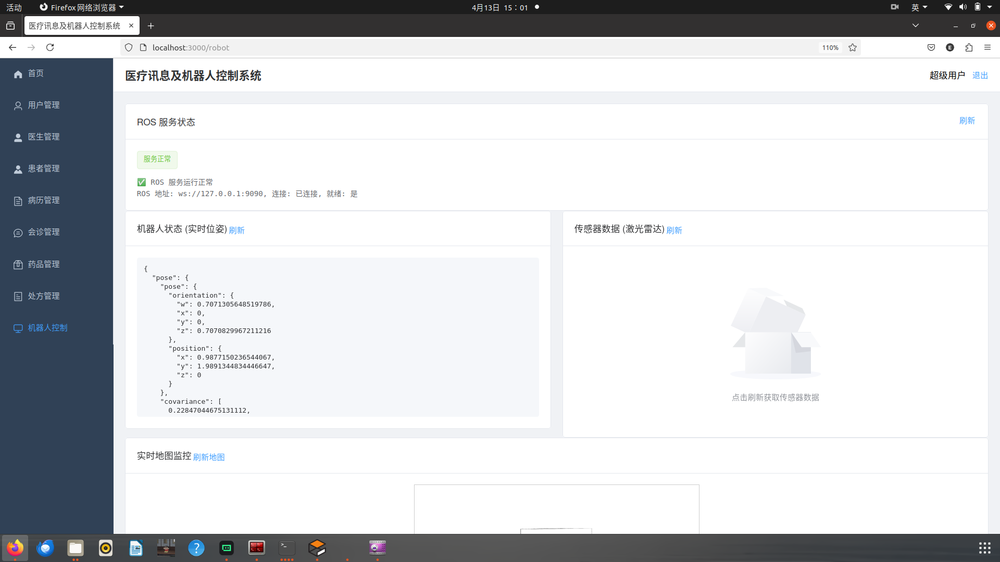
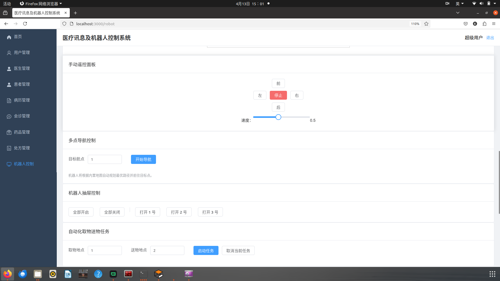
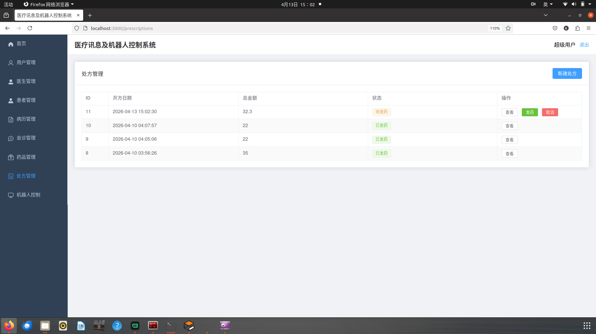
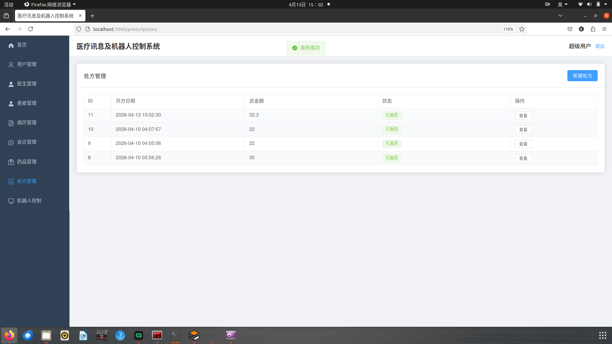
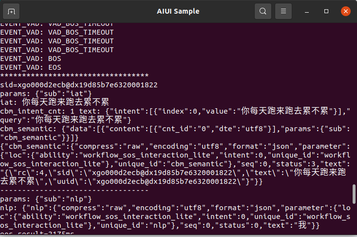

# 基于多传感器融合的医院管理与机器人系统 (毕业设计)

这是一个集成了医院日常管理、机器人自动化运输、语音交互及 Gazebo 仿真于一体的综合性毕业设计项目。

## 🌟 项目概览

本项目旨在通过机器人技术和信息化手段提升医院的运行效率。系统分为 **Web 管理端** 和 **机器人控制端 (ROS)** 两大部分，通过 **Rosbridge WebSocket** 实现前后端跨平台通信，并支持通过 **NATAPP** 进行内网穿透。

### 核心功能

* **🏥 医院信息化管理**
  * **用户权限管理**：支持超级管理员、医生、患者三种角色及对应权限。
  * **病历与会诊**：完整的病历记录、编辑、查看流程，以及医生间的会诊申请与处理。
  * **处方与药品**：处方开具、药品库存管理及发药流程追踪。
* **🤖 机器人自动化运输**
  * **实时地图与定位**：在 Web 端实时渲染机器人位置（AMCL）和环境地图。
  * **多点导航**：支持指定航点的一键前往。
  * **自动化取送物**：集成“取货 -> 运输 -> 送达”的全流程逻辑，支持抽屉硬件自动开关。
  * **手动遥控**：Web 端可视化摇杆/按钮控制机器人移动。
* **🎙️ 智能交互**
  * **语音识别与合成**：基于科大讯飞 AIUI 实现自然语言对话。
  * **音效反馈**：任务执行过程中的关键节点（如到达、任务开始）具备语音/音效播报。
* **🎮 Gazebo 仿真**
  * 基于 WPR 机器人的高保真医院环境仿真，支持激光雷达、IMU、摄像头等传感器融合。

## 🏗️ 架构设计

### 技术栈


| 层次             | 关键技术                                                          |
| :--------------- | :---------------------------------------------------------------- |
| **前端**         | Vue 3, Element Plus, Pinia, Axios, Vite, HTML5 Canvas             |
| **后端**         | Spring Boot 2.7, Spring Security + JWT, MyBatis, MySQL 8.0        |
| **机器人 (ROS)** | ROS Noetic, Gazebo, TEB Local Planner, AMCL, Gmapping, Python/C++ |
| **通信**         | Rosbridge Suite (WebSocket), RESTful API                          |
| **基础设施**     | Docker (MySQL), NATAPP (内网穿透)                                 |

### 系统组成

1. **`graduate_design/`**：ROS 工作空间，包含导航、语音、任务逻辑及仿真模型。
2. **`graduate_web/backend/`**：Spring Boot 后端，负责业务逻辑及与 ROS 的通信桥接。
3. **`graduate_web/frontend/`**：Vue 3 前端，提供管理后台和机器人控制面板。
4. **`graduate_web/database/`**：包含数据库初始化脚本 `init.sql`。

## 🚀 快速开始

### 1. 环境准备

* **ROS**: Ubuntu 20.04 + ROS Noetic
* **Java**: JDK 17
* **Node.js**: v16+
* **MySQL**: 8.0+ (推荐使用 Docker)

### 2. 数据库初始化

```bash
# 启动 MySQL 并执行脚本
mysql -u root -p < graduate_web/database/init.sql
```

### 3. 启动机器人仿真 (ROS)

```bash
cd graduate_design
catkin_make
source devel/setup.bash
# 启动仿真环境
roslaunch zj_base minimal.launch
# 启动导航与任务节点
roslaunch ucar_nav ucar_wpnav.launch
# 启动 Rosbridge
roslaunch ros_service take_websocket.launch
# 启动语音服务
roslaunch voice_service aiui.launch
# 启动智能取送物服务
rosrun hospital_transport  transport.launch
```

### 4. 启动后端 (Spring Boot)

```bash
cd graduate_web/backend
mvn clean install
# 确保 application.yml 中配置了正确的数据库和 ROS 地址
java -jar target/hospital-0.0.1-SNAPSHOT.jar
mvn spring-boot:run
```

### 5. 启动前端 (Vue 3)

```bash
cd graduate_web/frontend
npm install
npm run dev
```

## 🛠️ 关键配置

* **内网穿透**：使用根目录下的 `natapp` 运行，其中config.ini 是配置文件，需要根据实际情况修改。
* **跨域配置**：在 `graduate_web/backend/src/main/resources/application.yml` 中修改 `cors.allowed-origins` 以匹配你的 NATAPP 域名。
* **ROS 连接**：在后端 `RosConfig.java` 中配置 `rosbridge` 的地址（默认为 `ws://localhost:9090`）。

## 📸 项目演示


[<iframe src="//player.bilibili.com/player.html?isOutside=true&aid=116551386733487&bvid=BV1Xf5E61ECn&cid=38244585279&p=1" scrolling="no" border="0" frameborder="no" framespacing="0" allowfullscreen="true"></iframe>](https://www.bilibili.com/video/BV1Xf5E61ECn/?vd_source=2db0a2c913062d3711607d3e8ab73ab6)


机器人模型


仿真场景



网页端机器人管理页



网页端机器人控制选项



网页端新建处方后等待发药状态




[<iframe src="//player.bilibili.com/player.html?isOutside=true&aid=116551353113560&bvid=BV1tM5J6zE9a&cid=38244518416&p=1" scrolling="no" border="0" frameborder="no" framespacing="0" allowfullscreen="true"></iframe>](https://www.bilibili.com/video/BV1tM5J6zE9a/?vd_source=2db0a2c913062d3711607d3e8ab73ab6)


网页端发药成功并配送后返回状态




[[<iframe src="//player.bilibili.com/player.html?isOutside=true&aid=116551353112663&bvid=BV1tM5J6zEkz&cid=38244516727&p=1" scrolling="no" border="0" frameborder="no" framespacing="0" allowfullscreen="true"></iframe>](https://www.bilibili.com/video/BV1tM5J6zEkz/?vd_source=2db0a2c913062d3711607d3e8ab73ab6)](https://www.bilibili.com/video/BV1tM5J6zEkz/?vd_source=2db0a2c913062d3711607d3e8ab73ab6)

语音识别成功，并播报结果

**作者**: 现代信息产业学院-计算机科学与技术专业（产教融合创新班）-计科迅飞2203班-张杰-202212060103
**联系方式**:2318449734@qq.com
**日期**: 2026-04-13
